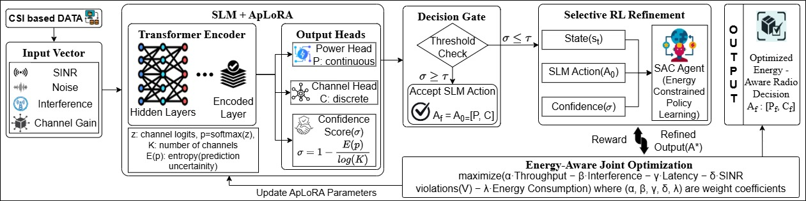

# 📡 Uncertainty-Guided SLM with Selective RL for Cognitive Radio Resource Allocation

This repository implements a Transformer-based SLM with uncertainty-guided decision routing and selective reinforcement learning (SAC) for efficient and constraint-aware cognitive radio resource allocation.

The framework integrates:
- Transformer-based SLM with Adaptive LoRA (AP-LoRA)
- Confidence-driven decision gating
- Selective Reinforcement Learning (SAC)
- SINR-aware constraint evaluation
- System-level wireless performance simulation

---

## 🧠 System Overview

Below is the high-level architecture of the proposed framework:



The framework combines learning-based decision making with uncertainty-aware energy-efficient routing and constraint-aware evaluation.

---

## 📂 Repository Structure

```
SLM_CR/
│
├── data/
├── environment/
│   └── cr_env.py
│
├── models/
│   ├── energy_model.py
│   ├── slm_model.py
│   ├── slm_model.pth
│   ├── sac_cr_model.zip
│   ├── ppo_cr_model.zip
│   └── ddpg_cr_model.zip
│
├── training/
│   ├── train_slm.py
│   ├── train_sac.py
│   ├── train_ppo.py
│   └── train_ddpg.py
│
├── evaluation/
│   ├── test_slm.py
│   ├── test_rl.py
│   ├── test_sac.py
│   ├── test_ppo.py
│   ├── test_hybrid.py
│   └── test_cr.py
│
├── utils/
│   ├── confidence_threshold_analysis.py
│   ├── sinr_constraint_analysis.py
│   ├── slm_ablation.py
│   ├── logger.py
│   ├── hybrid_comparison.py
│   └── rl_comparison.py
│
├── script/
│   ├── joint_optimization.py
│   ├── feedback_loop.py
│   ├── hybrid_system.py
│   └── simulation_metrics.py
│
├── plots/
│   ├── radar_energy.png
│   ├── energy.png
│   ├── A3.png
│   ├── B2.png
│   ├── B3.png
│   ├── C1.png
│   └── D2.png
│
├── README.md
├── requirements.txt
└── .gitignore
```

---

## 📊 Dataset Description

The model uses a synthetic wireless dataset representing cognitive radio environments.

Each sample consists of:

[h1, h2, h3, h4, sinr1, sinr2, sinr3, sinr4, interference, noise]

Where:
- h → channel gains
- sinr → precomputed SINR (used as features)
- interference → aggregated interference
- noise → channel noise

---

## 🚀 How to Run

Train SLM:
python training/train_slm.py

Train RL (SAC):
python training/train_sac.py

Test Hybrid System:
python evaluation/test_hybrid.py

Compute Metrics:
python script/simulation_metrics.py

SINR Analysis:
python utils/sinr_constraint_analysis.py

Threshold Analysis:
python utils/confidence_threshold_analysis.py

---

## 📈 Outputs

- Power & channel decisions
- SLM vs RL usage
- Throughput, latency, interference
- SINR violation rate
- Reward trends

---

## 🔐 Key Features

- Uncertainty-guided decision routing (σ vs τ)
- Selective RL for complex scenarios
- Adaptive LoRA for dynamic model updates
- Constraint-aware SINR evaluation
- Multi-objective optimization via reward learning

---
